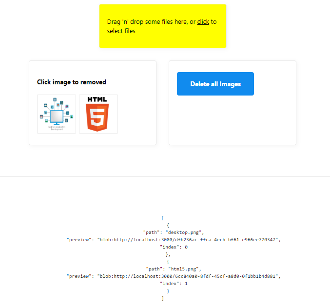

## Dropzone Files

Simple Drag and Drop files images*

More details 🚀 [react-dropzone](https://github.com/react-dropzone/react-dropzone) 

## Screenshot

  

## Author

✔ Eka Prasetia 🤵

✔ Collection my App

Find example all my [Scratch App](https://twolevel.net) 👉 on working 🛠

✔ Community

I am author for two communities in Indonesia

- GatsbyJS Indonesia [Gatsby-ID](https://gatsbyjs.id)
- RedwoodJS Indonesia [Redwood-ID](https://redwoodjs.id)
